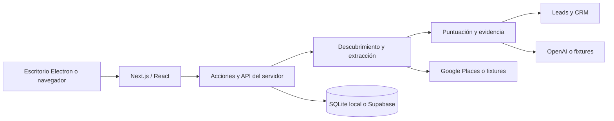

# Objetivo y arquitectura

## Qué se busca con Cantera

El proyecto propone un flujo de prospección para profesionales que venden servicios a otros negocios. Su objetivo es ayudar a decidir a quién contactar y con qué argumento, conservando un seguimiento de lo que ya se hizo.

El recorrido transforma una oferta y una ubicación en una lista de oportunidades: descubre negocios, elimina duplicados, lee señales públicas, calcula una puntuación explicable y permite redactar mensajes basados en lo observado. El CRM recoge decisiones, notas y seguimientos. Una puntuación alta expresa encaje con la oferta; no demuestra interés comercial, ingresos ni disposición a comprar.

## Componentes

Next.js mantiene las credenciales y el trabajo de extracción en el servidor. React muestra los formularios y estados del proceso. La versión de escritorio inicia ese mismo servidor en una dirección loopback con un puerto disponible y abre una ventana Electron aislada, sin acceso a Node desde el contenido web.

`lib/providers/` implementa las interfaces de búsqueda e IA. El modo fixture produce resultados deterministas; live llama a las APIs, y cassette conserva una respuesta real para pruebas posteriores. Las webs ficticias se sirven desde `/demo-site/[slug]` para que el extractor recorra HTML sin depender de internet.

`lib/pipeline/` separa descubrimiento, extracción, prefiltro y puntuación. El score combina encaje de nicho, señal del problema, capacidad estimada y contactabilidad. Las citas de evidencia se comprueban contra el texto extraído. Una evidencia que no aparece en ese texto se descarta.

## Cuentas y persistencia

En modo local la cuenta se registra en SQLite. Las contraseñas usan hash scrypt con sal; no se guardan como texto. Cada sesión se representa con una cookie httpOnly, y la base conserva su token derivado. Las consultas de usuario aíslan perfiles, ofertas, búsquedas, leads y actividades.

La primera cuenta obtiene el rol de administración local. La cuenta y la base pertenecen a esta instalación. No hay recuperación por correo ni sincronización entre equipos en este modo.

La configuración de proveedores se guarda por usuario y sus claves se cifran en disco. El material que permite descifrarlas está en la misma carpeta privada del equipo: el cifrado evita guardarlas como texto legible, pero no protege frente a alguien con acceso completo a esa carpeta. La copia de seguridad debe incluirla entera.

Supabase es la alternativa para usuarios y datos compartidos. Usa su autenticación, Postgres, políticas RLS y las migraciones de `supabase/migrations/`. El escritorio distribuido funciona por defecto con cuentas locales; una instalación central requiere configurar y operar Supabase.

## Límites del alcance

- El dataset de demostración representa diez negocios ficticios; no es un directorio real ni adapta sus negocios al nicho solicitado.
- El producto redacta y permite copiar mensajes. No los envía automáticamente.
- Las webs protegidas, inaccesibles o sin contenido útil pueden producir resultados incompletos. No se debe interpretar ausencia de evidencia como prueba de que un problema existe.
- El score orienta la revisión humana. Las afirmaciones comerciales requieren comprobación.
- Los importes mostrados por la aplicación son estimaciones; los cargos reales los determina cada proveedor.
- Cualquier servicio central requiere supervisión, copias, control de gasto y una prueba de integración con sus credenciales reales.

Las decisiones y fases del prototipo previo permanecen en [historial-original.md](historial-original.md). Sus precios, planes, fases y afirmaciones de validación son históricos y no certifican el estado actual.
